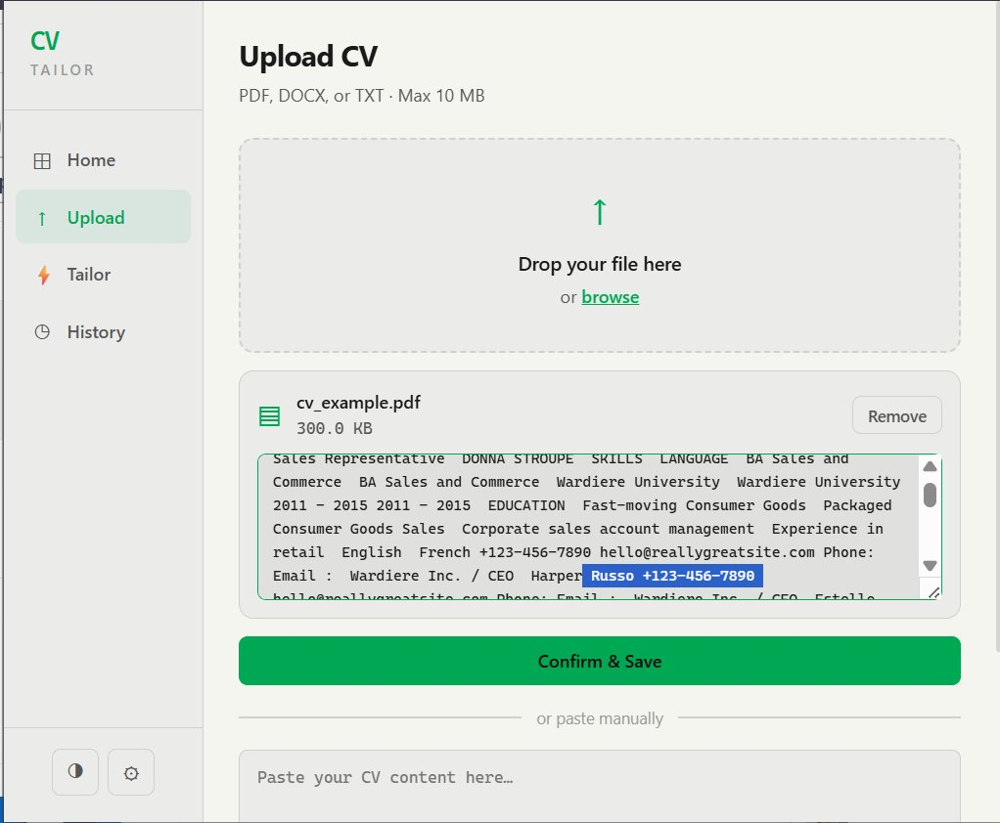
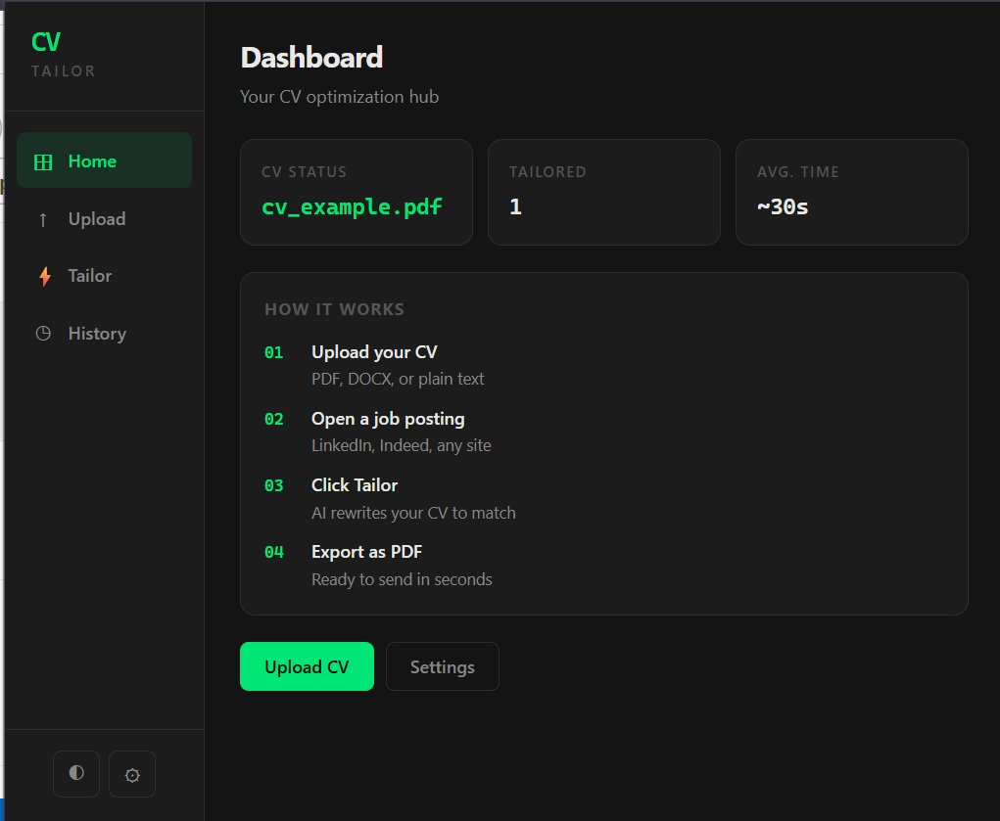
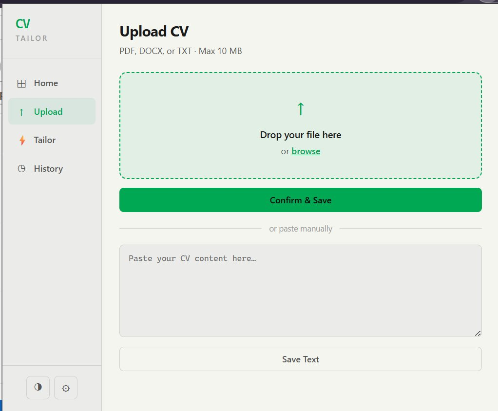
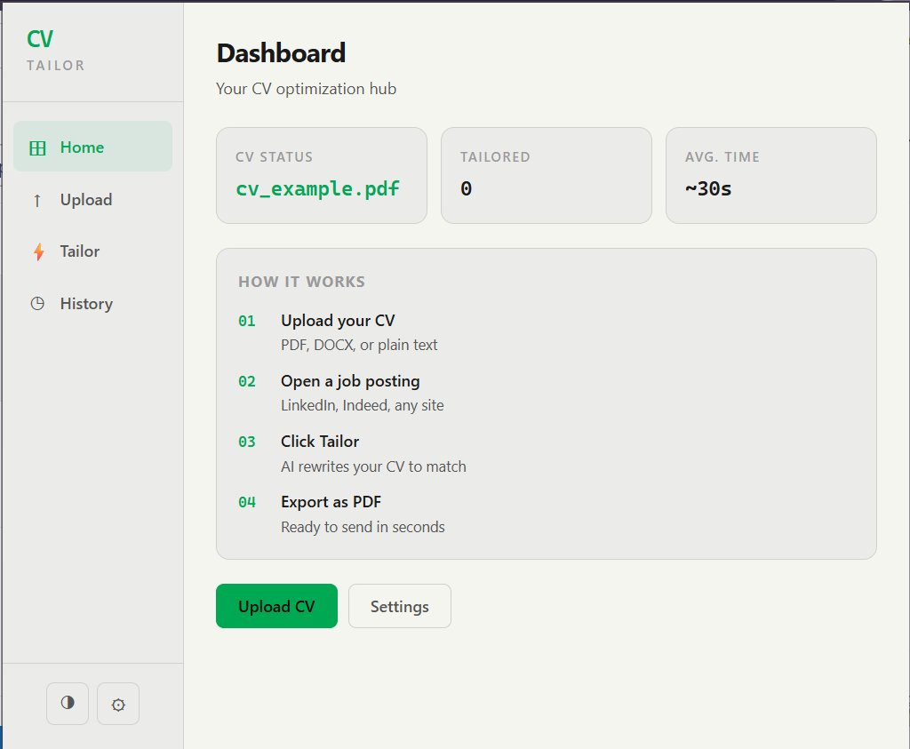
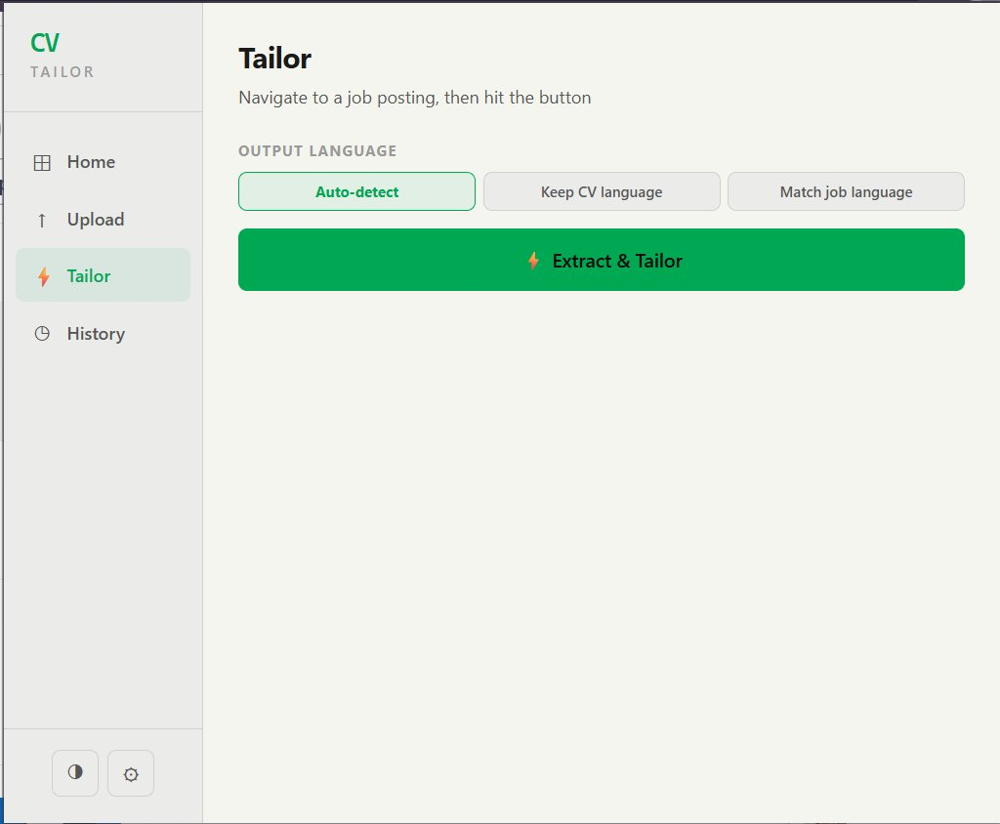
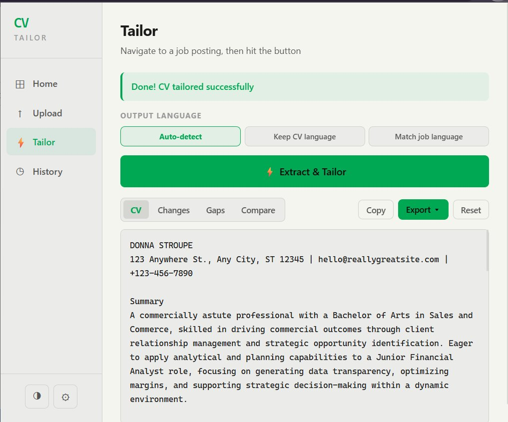
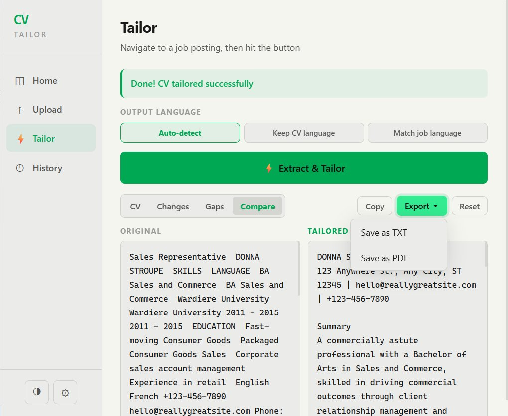
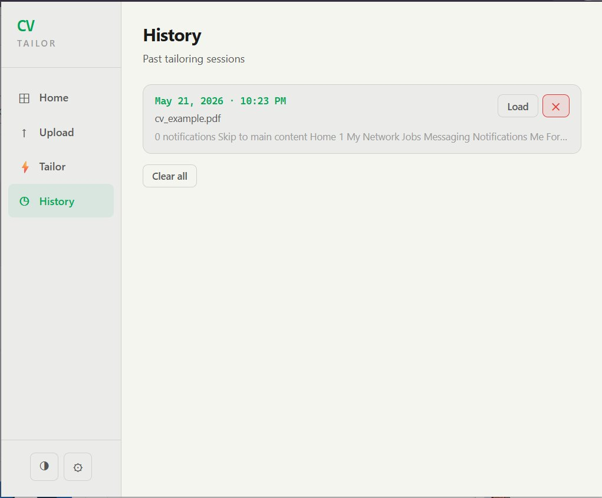
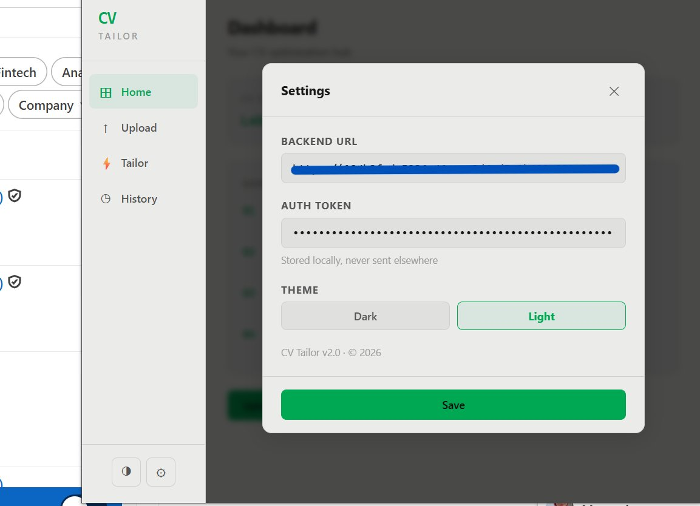

# ✨ CV Tailor

> AI-powered browser extension that adapts your CV to any job posting in seconds.

Upload your resume → Open a job listing → Let AI optimize your CV instantly.


## 💼 Why This Exists

Applying to jobs manually is repetitive.

CV Tailor automates the painful part:
rewriting your resume for every single application.

```
One CV.
Multiple job posts.
Tailored instantly.
```

## 🔐 API Access

The backend API is protected with an authentication token.

If you'd like to test the extension, please contact me to request a temporary access token.

This helps prevent abuse and unauthorized API usage.


## 📸 Preview
<table>
  <tr>
    <td align="center" width="50%"><b>Dashboard (Light)</b></td>
    <td align="center" width="50%"><b>Dashboard (Dark)</b></td>
  </tr>
  <tr>
    <td></td>
    <td></td>
  </tr>
  <tr>
    <td align="center"><b>Upload</b></td>
    <td align="center"><b>Upload with Preview</b></td>
  </tr>
  <tr>
    <td></td>
    <td></td>
  </tr>
  <tr>
    <td align="center"><b>Tailoring</b></td>
    <td align="center"><b>Results</b></td>
  </tr>
  <tr>
    <td></td>
    <td></td>
  </tr>
  <tr>
    <td align="center"><b>Compare</b></td>
    <td align="center"><b>History</b></td>
  </tr>
  <tr>
    <td></td>
    <td></td>
  </tr>
  <tr>
    <td align="center"><b>Settings</b></td>
  </tr>
  <tr>
    <td></td>
  </tr>
</table>


## ✨ Features

### 🤖 AI-Powered CV Tailoring
Analyzes job descriptions and rewrites your CV to better match:
- Keywords
- Responsibilities
- Required skills
- ATS filters

### 📄 Multi-Format CV Upload
Supports:
- PDF
- DOCX
- TXT

### ✏️ Editable Extraction
After upload, extracted text is fully editable before saving — fix formatting or remove irrelevant sections.

### 🌐 Smart Language Detection
Three output modes:
- **Auto-detect** — matches job description language automatically
- **Keep CV language** — preserves your original language
- **Match job language** — forces output to job language

### 🌍 Smart Job Detection
Extracts job descriptions directly from:
- LinkedIn
- Indeed
- Glassdoor
- StepStone
- Welcome To The Jungle
- Greenhouse, Lever, Workday
- Generic job sites

### 📊 Match Analysis
Get:
- Tailored CV
- Changes made
- Missing skills / gaps
- Side-by-side comparison

### 📥 Export Results
- Save as TXT
- Save as PDF (print dialog)

### 🌙 Dark / Light Mode
Toggleable from the sidebar.

### 🔒 Privacy First
- No permanent storage
- CVs processed on demand
- Bearer-token authentication
- Secrets stored server-side only


## 🏗️ Architecture

```
Chrome Extension
       ↓
Express Backend API
       ↓
Google Gemini AI
       ↓
Tailored CV + Suggestions
```


## ⚡ Quick Start

### 1. Clone Repository

```bash
git clone https://github.com/yourusername/cv-tailor.git
cd cv-tailor
```

### 2. Backend Setup

```bash
cd backend
npm install
```

Create `.env`:

```env
GEMINI_API_KEY=your_gemini_api_key
AUTH_TOKEN=your_secure_token
PORT=3000
```

Start server:

```bash
npm run dev
```

### 3. Load Extension

Open `chrome://extensions`, then:

1. Enable **Developer Mode**
2. Click **Load unpacked**
3. Select the `/extension` folder

### 4. Configure Extension

Inside the popup Settings:

| Setting | Value |
|---|---|
| Backend URL | `http://localhost:3000` |
| Auth Token | same `AUTH_TOKEN` from `.env` |


## 🚀 Hybrid Deployment

This repo supports a hybrid setup:

- Local/Replit backend while developing
- Northflank-hosted backend in production
- Chrome extension configured from Settings

See [`DEPLOYMENT.md`](./DEPLOYMENT.md) for the full GitHub + Northflank setup.


## 🛠️ Tech Stack

| Layer | Technology |
|---|---|
| Extension | JavaScript, HTML, CSS |
| Backend | Node.js + Express |
| AI | Google Gemini |
| PDF Parsing | PDF.js |
| DOCX Parsing | Mammoth.js |
| Deployment | Local/Replit + Northflank |


## 📂 Project Structure

```
cv-tailor/
│
├── extension/
│   ├── manifest.json
│   ├── popup.html
│   ├── popup.js
│   ├── popup.css
│   ├── content.js
│   ├── background.js
│   ├── images/
│   └── lib/
│       ├── pdf.min.js
│       ├── pdf.worker.min.js
│       └── mammoth.min.js
│
├── backend/
│   ├── server.js
│   ├── package.json
│   ├── .env.example
│   ├── Dockerfile
│   └── .env           # local only, never committed
│
└── assets/
    ├── dashboard.png
    ├── upload.png
    ├── upload_preview.png
    ├── tailoring.png
    ├── results.png
    ├── results_compare.png
    ├── history.png
    ├── settings.png
    └── darkmode.png
```


## 🔒 Security

- API keys never exposed in extension
- All AI processing handled server-side
- Bearer-token authentication
- CORS restricted
- `.env` excluded from Git


## ⚠️ Disclaimer
Always review AI-generated CV modifications before submitting applications.


**❤️ Made with love: Zaynab**
